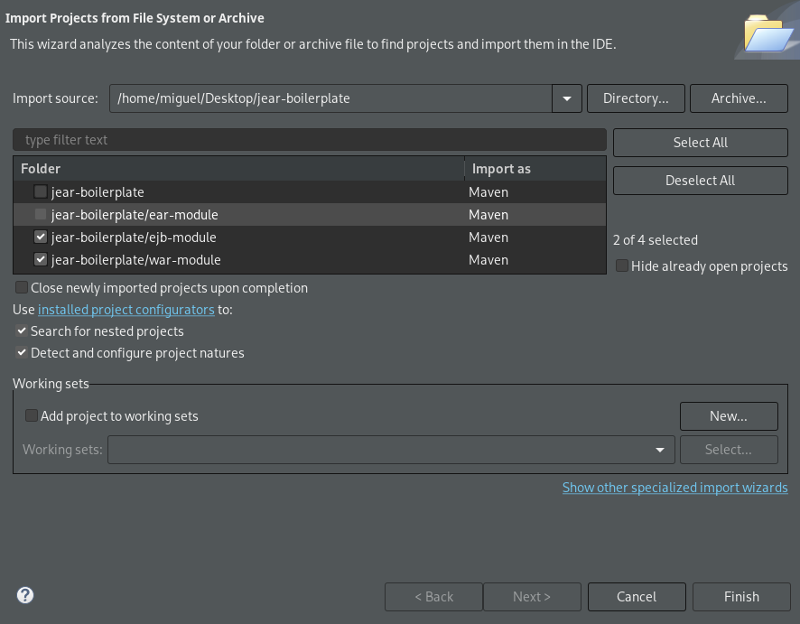
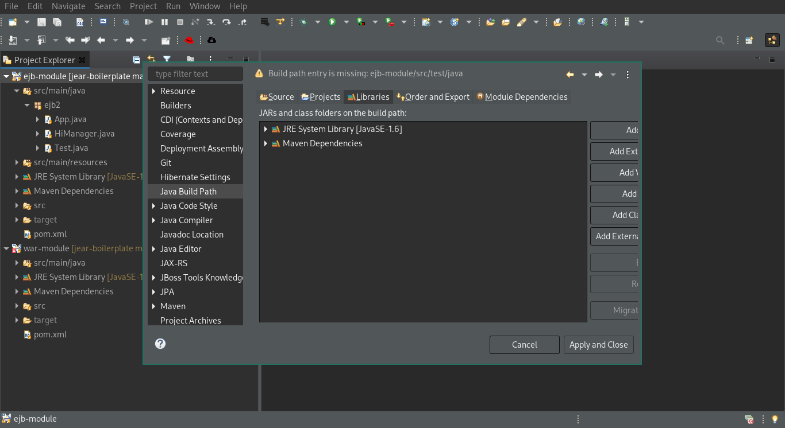
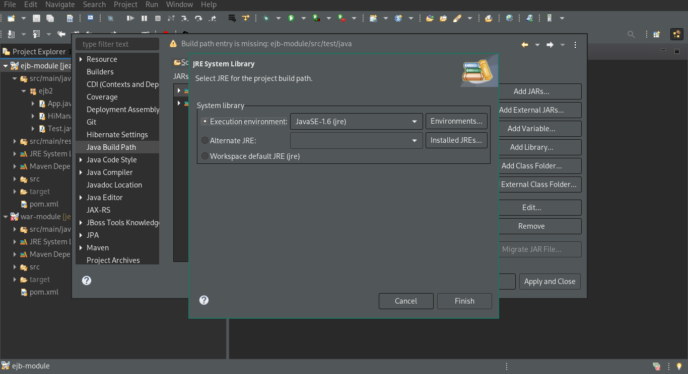
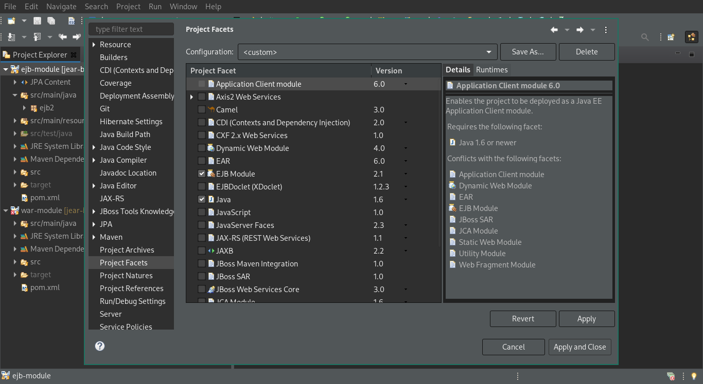
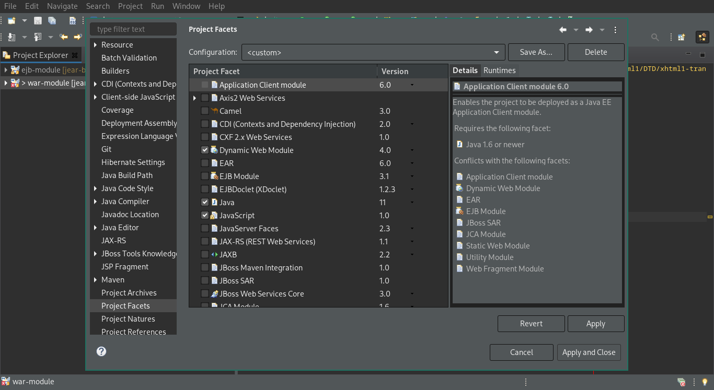
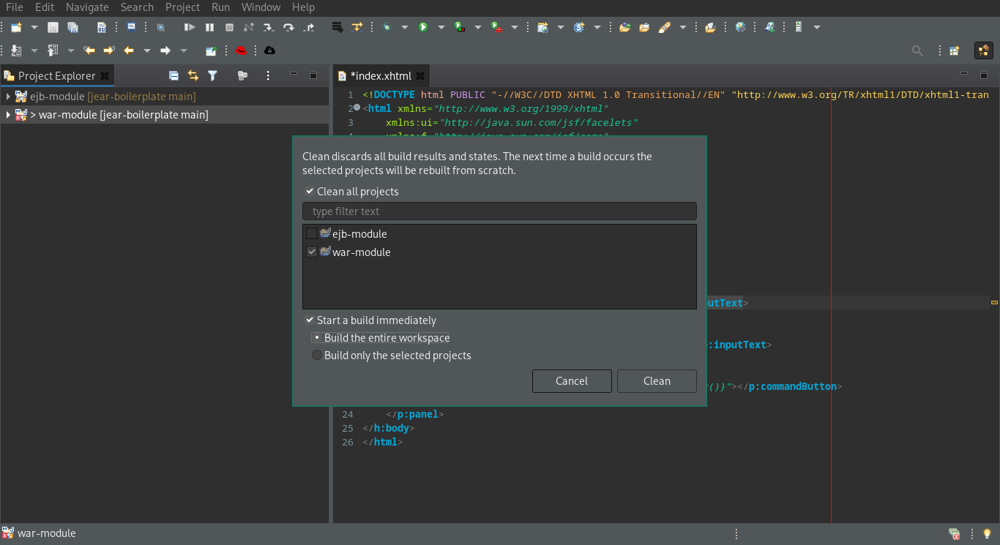

# MVN, EAR, EJB, JSF Boilerplate.

## About

This boilerplate is meant to be used with any distribution of wildfly that supports Jakarta EE 8, after clonning it you might delete the README.md file and readme_assets folder.

## How to create new modules

1. Download the proper boilerplate code of the kind of module you want to add.  
   [EJB](https://github.com/migonos01454f/jejb-boilerplate)  
   [WAR](https://github.com/migonos01454f/jwar-boilerplate)
2. Change the module's artifactId according to your needs.
3. Register the new module under the modules section of the parent pom.xml file.  
   Eg:

```xml
<module>new-war-module</module>
```

4. Register the new module under the dependencyManagement/dependencies section of the pom.xml file.  
   Eg:

```xml
<dependency>
	<groupId>${project.groupId}</groupId>
	<artifactId>new-war-module</artifactId>
	<version>${project.version}</version>
	<type>war</type>
</dependency>
```

5. Register the new module under the dependencies section of the ear-module/pom.xml file.  
   Eg:

```xml
<dependency>
	<groupId>${project.groupId}</groupId>
	<artifactId>new-war-module</artifactId>
	<type>war</type>
</dependency>
```

6. Register the new module under the configuration section of the maven-ear-plugin located in the ear-module/pom.xml file.
   Eg:

```xml
<webModule>
	<groupId>${project.groupId}</groupId>
	<artifactId>new-war-module</artifactId>
	<contextRoot>/new_war_module</contextRoot>
	<bundleFileName>new-war-module-${project.version}.war</bundleFileName>
</webModule>
```

## How to change the "contextRoot" (direction where the web page is available)

1. Enter the "ear-module" folder.
2. Look for the line `<contextRoot>/jear_boilerplate</contextRoot>`
3. Modify the path inside the contextRoot tags to fit your needs.

## Available commands

1. Package:

```bash
mvn package
```

2. Deploy to wildfly server:
   1. Start an instance of wildfly.
   2. Execute:
   ```bash
   mvn clean package && mvn wildfly:deploy
   ```
3. Get help of wildfly plugin:
   1. Under the ear-module directory execute:
   ```bash
   mvn wildfly:help
   ```
4. Redeploy to widlfly server having previously deployed the project:
   ```bash
   mvn clean package && mvn wildfly:redeploy
   ```

## Tailoring the experience for Eclipse IDE

Altough the boilerplate can be used in any IDE, it has been built with Eclipse in mind.  
In order to get the best experience or replicate the integration of an Enterprise Application Project created from Eclipse itself; which means be able to use code wizards to generate: entities, session beans, beans and get code recommendations on your xhtml pages. You must follow this steps, keep in mind that this steps won't affect the compiling lifecycle nor matter to it, as it is supossed to be handled by maven:

1. Under the "File" menu, select the option "Open Projects from File System..."
2. Press the button "Directory..." and find the forder where you cloned the boilerplate.
3. Select the ejb and war modules and press "Finish".  
   
4. Select the ejb module under the "Project Explorer".
5. Under the "Project" menu, select the option "Properties".
6. Select the "Java Build Path" property and the "Libraries" tab.  
   
7. Select "JRE System Library" and press the "Edit" button.
   
8. Mark "Workspace default JRE (jre) and press "Finish".
9. Press the "Apply" button.
10. Select the "Project Facets" property.  
    
11. Change the "Java" version to 11 or newer.
12. Change the "EJB Module" version to 3.2 or newer.
13. Click "Apply and Close".
14. Select the war module under the "Project Explorer".
15. Under the "Project" menu, select the option "Properties".
16. Repeat the steps from 6 to 10.
17. Enable the "Java" facet and set its version to the same version of the ejb-module.
18. Enable the "Dynamic Web Module" facet.
    
19. Click "Apply and Close".
20. Under the "Project" menu, select the option "Clean..." and clean all the projects clicking the "Clean" button.
    

## Made possible by

1. [Maven J2EE Archetype](https://pastebin.com/raw/TLTFh9aW)
2. [How to build an EAR project with EJB and WAR using Maven?](https://stackoverflow.com/questions/32990664/how-to-build-an-ear-project-with-ejb-and-war-using-maven)
3. [Apache Maven EAR Plugin Documentation](https://maven.apache.org/plugins/maven-ear-plugin/index.html)
4. [Wildfly's quickstart repository](https://github.com/wildfly/quickstart)
5. [Sgilda's quickstart repository](https://github.com/sgilda/wildfly-quickstart)
